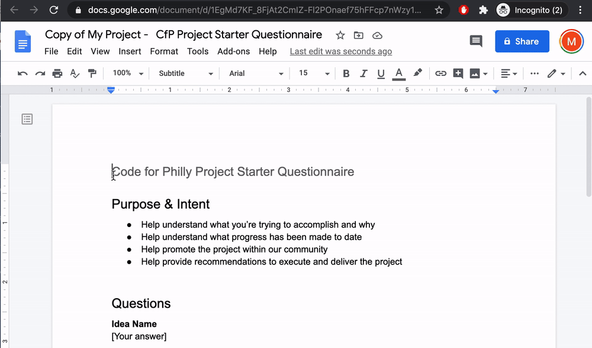
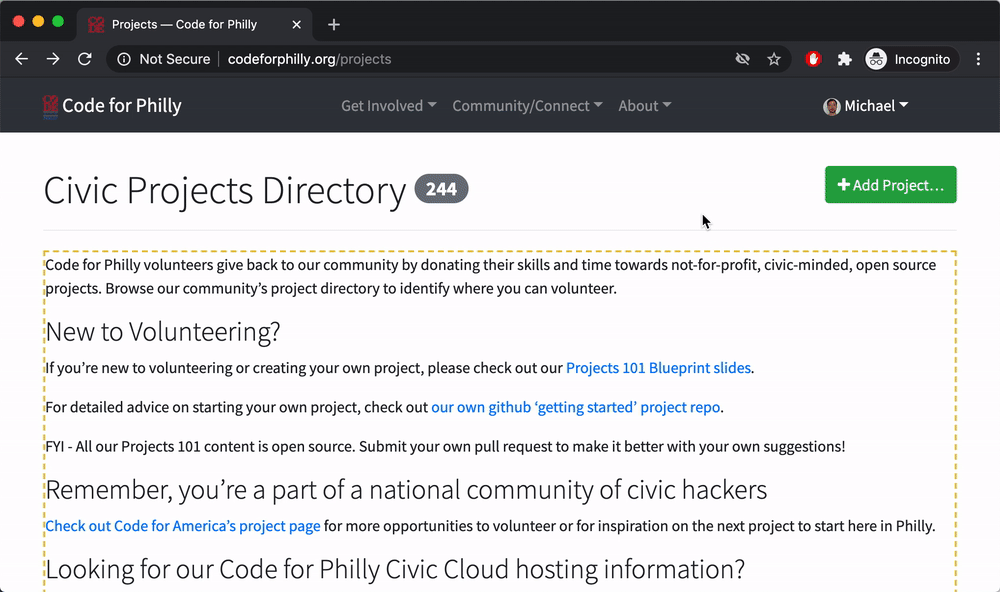
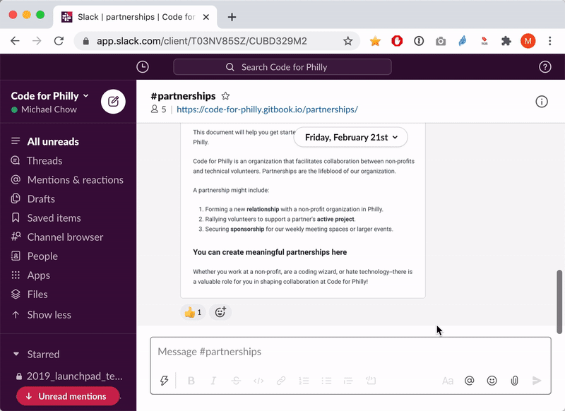

# Project creation walkthrough

\*\*\*\*[**📣**](https://emojipedia.org/megaphone/)**: We have an** [**open projects co-lead role**](https://codeforphilly.org/pages/leadership-support_team_open_positions/#projects-lead) **on the Code for Philly leadership team.**

Before starting a project, make sure that you have a Code for Philly account and have joined our [\#partnerships slack channel](http://codeforphilly.org/chat?partnerships) \(shown in screencast below\).



There are four steps to creating a project.

* [ ] [**Check**](first-steps.md#check) ****- read our [project guidelines](https://codeforphilly.org/pages/project_guidelines) to ensure it meets our criteria.
* [ ] \*\*\*\*[**Setup**](first-steps.md#setup) ****- fill out the intake questionnaire, then create a project page and slack channel.
* [ ] \*\*\*\*[**Plan**](first-steps.md#plan) - list a small roadmap on your project page.
* [ ] \*\*\*\*[**Rally**](first-steps.md#rally) - schedule a hacknight for presenting.

### Check

Broadly, our [project guidelines](https://codeforphilly.org/pages/project_guidelines) ask projects to meet four criteria:

* For the public good.
* Open source and available to the public.
* Adhere to our [Code of Conduct](https://codeforphilly.org/pages/code_of_conduct)
* Not political or partisan.

These are guidelines, and not rules. Code for Philly leadership is happy discuss project ideas that may seem like they fall outside the guidelines.

### Setup

#### **Intake questionnaire**

Create a copy of the [project intake questionnaire](https://docs.google.com/document/d/14_ca80-Ph9_WNyD99uXd2JuVZkCxEPqxEbtKjqo_mig/edit?usp=sharing) \(shown below\), and fill it out.

This document asks about who your project is for, its goals, and any delivery dates you are working toward. It helps us share and discuss the project within Code for Philly leadership.

If you'd rather it not be publicly available, please email it to leadership@codeforphilly.org. Otherwise, share it on the [partnership slack channel](https://codeforphilly.org/chat?channel=partnerships).

#### Project page

First, go to the [Code for Philly projects page](https://codeforphilly.org/projects), and "add project" \(shown below\).Here, you can enter the title of your project, and name of your projects soon-to-be slack channel.

Here, you can enter the title of your project and name of your soon-to-be slack channel. In general, it's helpful to name your slack channel something similar to your project title. For example, if your project is named My Civic Project, a good slack channel might be my-civic-project.

At the very bottom of the page, you'll add a **description of your project**. The description can be formatted using [markdown syntax](https://guides.github.com/pdfs/markdown-cheatsheet-online.pdf). 

The description you enter should be enough for volunteers to answer:

* Who is this for?
* What are its goals?
* What roles are needed \(e.g. frontend engineer, or UX person\)

See these the [PLSE expungement](https://codeforphilly.org/projects/philadelphia_lawyers_for_social_equity_-_record_expungement), [PAWS](https://codeforphilly.org/projects/paws_data_pipeline), and [Phlask](https://codeforphilly.org/projects/phlask--life-liberty_and_the_pursuit_of_water) projects for examples.

#### Slack channel

Sign on to the [Code for Philly slack](https://codeforphilly.org/chat?channel=partnerships). Pull up the create channel form and enter your channel name \(shown below\). The channel name should be the same as the one you entered when you created the project page \(in the field "Chat channel/hashtag"\).

### Plan

It's okay to start a Code for Philly project while you're still in the ideation / planning phase. Once you draw closer to implementation, be sure to add a plan with a roadmap and/or timeline to your project. This helps recruit more volunteers to your project, by showing them there is implementation work to do.

A project update is shown on the Code for Philly homepage. For an example, see this [roadmap update by the Phlask project](https://codeforphilly.org/projects/phlask--life-liberty_and_the_pursuit_of_water/updates/7).

### Rally

There are several ways to increase engagement with your project, and get things moving towards the project's goals. When Code for Philly leadership have capacity, we can events like...

* **Hack night presentations**. Hack night is an event that occurs several times a month. See our [events page](https://www.meetup.com/Code-for-Philly/events/) for upcoming hack nights. Please reach out to Code for Philly leadership if you are interested in presenting at a hack night. If there are no hack nights scheduled, and we have capacity, we can work on creating an event.
* **Guiding volunteers to your project**. If you keep activity in your project's slack channel, it helps us follow along with how things going, and point new volunteers to your project. 

Even without leadership involvement, there are many ways to recruit and organize volunteers at Code for Philly, including...

* Posting in the [\#projects\_help\_wanted](http://codeforphilly.org/chat?channel=projects_help_wanted) slack channel
* Attending hack nights \(or having weekly online project meetings\)
* Contributing to other Code for Philly projects, to get a sense for how projects can be organized.

### 

